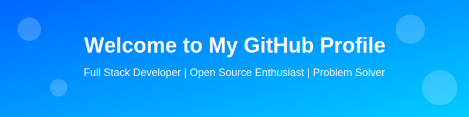

<div align="center">
  
</div>

<div align="center">
  
</div>

## 🚀 About Me

I'm a passionate developer who loves to build amazing web applications and contribute to open source. My goal is to create efficient, scalable, and user-friendly solutions that make a difference.

## 🛠️ Tech Stack

### Frontend


### Backend


### Database


### DevOps & Tools


## 📊 GitHub Stats & Activity

<div align="center">
  
  
  
</div>

## 🏆 GitHub Trophies

[](https://github.com/ryo-ma/github-profile-trophy)

## 🔥 Recent Activity

<!--START_SECTION:activity-->
<!--END_SECTION:activity-->

## 🚀 Projects

<table>
  <tr>
    <td width="50%">
      <h3>Project 1</h3>
      <p>Description of project 1 with technologies used.</p>
      <a href="#" target="_blank">View Project</a> | 
      <a href="#" target="_blank">View Code</a>
    </td>
    <td width="50%">
      
    </td>
  </tr>
  <tr>
    <td width="50%">
      
    </td>
    <td width="50%">
      <h3>Project 2</h3>
      <p>Description of project 2 with technologies used.</p>
      <a href="#" target="_blank">View Project</a> | 
      <a href="#" target="_blank">View Code</a>
    </td>
  </tr>
</table>

## 📫 Let's Connect

<div align="center">
  <a href="https://linkedin.com/in/your-linkedin" target="_blank">
    
  </a>
  <a href="https://twitter.com/your-twitter" target="_blank">
    
  </a>
  <a href="mailto:your-email@gmail.com" target="_blank">
    
  </a>
  <a href="https://github.com/NareshRana" target="_blank">
    
  </a>
  <a href="https://dev.to/your-devto" target="_blank">
    
  </a>
</div>

## 👨‍💻 Coding Activity

<!--START_SECTION:waka-->
```text
💬 Programming Languages: 
JavaScript                ████████████████████░░░░░   80.0% 
Python                    ███████░░░░░░░░░░░░░░░░░░   30.0%
TypeScript                ██████░░░░░░░░░░░░░░░░░░░   25.0%
CSS                       ████░░░░░░░░░░░░░░░░░░░░░   20.0%
```
<!--END_SECTION:waka-->

## 🎯 Currently Learning & Goals

<div align="center">
  
  
  
  
  
</div>

## 📈 GitHub Stats Graph

[](https://github.com/ashutosh00710/github-readme-activity-graph)

## ⚡ Fun Facts

- 🔭 I'm currently working on improving my problem-solving skills on LeetCode
- 🌱 I'm currently learning about cloud architecture and microservices
- 👯 I'm looking to collaborate on open source projects
- 💬 Ask me about web development and programming
- ⚡ Fun fact: I can solve a Rubik's cube in under 2 minutes!

## 🎵 Now Playing

[](https://open.spotify.com/user/your-spotify-id)

## 👀 Profile Views


---

<div align="center">
  
</div>

<div align="center">
  
</div>

---

<div align="center">
  <h3>Thanks for visiting! 😊</h3>
  <p>⭐️ From <a href="https://github.com/NareshRana">NareshRana</a></p>
</div>
